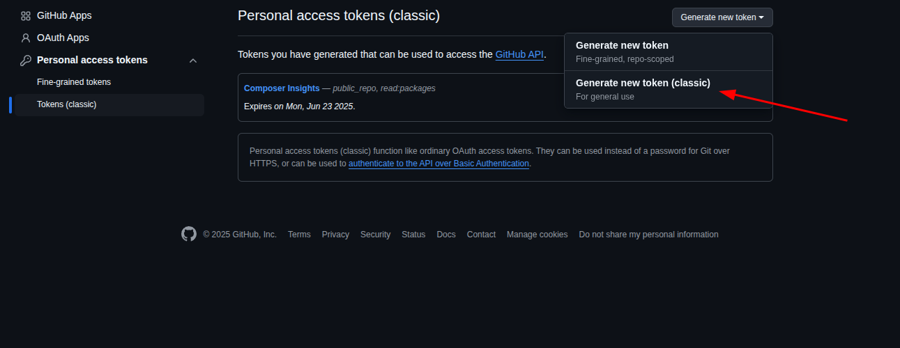
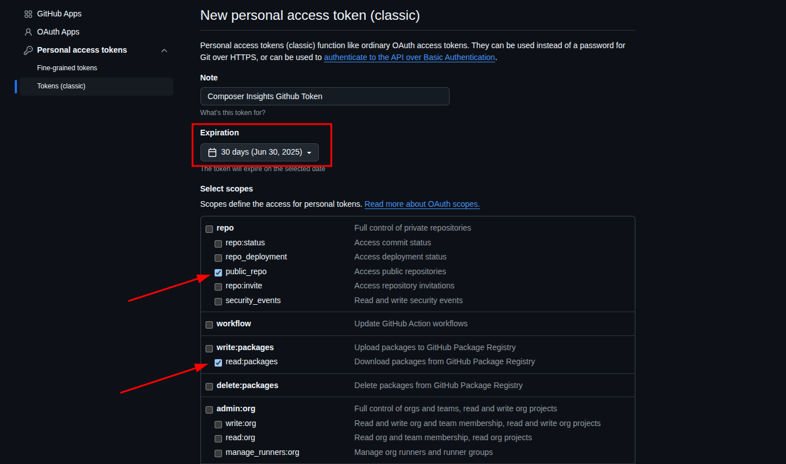

# 📦 Composer Insights

[](https://github.com/sagautam5/composer-insights/stargazers)
[](//packagist.org/packages/sagautam5/composer-insights)
[](//packagist.org/packages/sagautam5/composer-insights)

[](https://github.com/sagautam5/composer-insights/network/members) 
[](https://github.com/sagautam5/composer-insights/actions/workflows/ci.yml)

**Composer Insights** is a CLI tool that analyzes your PHP project's composer dependencies and provides insightful GitHub and Packagist statistics for each top-level dependency.

---

## ✨ Features

- 🔍 Analyze direct dependencies from composer
- ⭐ Fetch GitHub repository data: stars, forks, open issues, last update
- 📈 Get download stats from Packagist
- 🧹 Clean tabular output in the terminal
- 🛑 Gracefully skips non-GitHub packages
- ⚡ Fast, dependency-free CLI experience

---

## 💡Example Output

```
🔍 Fetching Composer Dependency Insights

🔍 Fetching Composer Dependency Insights

+-------------------+---------+-----------------------+-----------------------------+-----------+--------------+----------------------------+
| Package           | License | Version (Latest|Used) | Stars | Forks | Open Issues | Downloads | Last Updated | Last Release (Date | Time) |
+-------------------+---------+-----------------------+-----------------------------+-----------+--------------+----------------------------+
| guzzlehttp/guzzle | MIT     | 7.9.3 | 7.9.3         | 23.4k | 2.4k | 31           | 845.5M    | 1 day ago    | 2025-03-27 | 2 months ago  |
| nesbot/carbon     | MIT     | 3.9.1 | 3.9.1         | 89 | 12 | 2                 | 556.4M    | 8 hours ago  | 2025-05-01 | 4 weeks ago   |
| symfony/console   | MIT     | v7.3.0 | v7.3.0       | 9.8k | 264 | 1              | 933.1M    | 23 hours ago | 2025-05-29 | 1 day ago     |
| pestphp/pest      | MIT     | v3.8.2 | v3.8.2       | 10.3k | 386 | 168           | 33M       | 3 hours ago  | 2025-04-17 | 1 month ago   |
+-------------------+---------+-----------------------+-----------------------------+-----------+--------------+----------------------------+

✅ Done

```

---

## 📥 Installation

You can install it in any Composer-based local PHP project as dev dependency:

```bash
composer require composer-insights/composer-insights --dev
```

Make sure your project has both `composer.json` and `composer.lock` files.

To avoid GitHub API rate limits and to enable access to private repos, set your GitHub token as an environment variable:

```bash
export GITHUB_TOKEN=your_github_token
```

You can generate a personal access token from [https://github.com/settings/tokens](https://github.com/settings/tokens)

## 📸 Screenshots

**Classic Token Option**



**Privillages For Token**




---

## 🧪 Usage

Run the following command to start the analysis:

```bash
vendor/bin/composer-insights analyze
```

### 🔧 Command Options

 **Development Dependencies**

You can control whether to include or exclude development dependencies using these options:

- `--dev`: Include development dependencies in the analysis
- `--no-dev`: Exclude development dependencies from the analysis

By default, all dependencies will be considered


This will:

- Parse your composer file
- Check each direct dependency (ignores transitive)
- Fetch GitHub and Packagist stats
- Display a beautiful CLI table

---

## 📋 Requirements

- PHP 8.0 or higher
- A Composer-based project
- Internet connection

---

## 🪪 License

This package is open-sourced under the [MIT License](LICENSE).

---

## 🔐 Security
If you discover a security vulnerability within this package, please send an e-mail to sagautam5@gmail.com, All security vulnerabilities will be promptly addressed.

## 🤝 Contributing

Want to contribute to Composer Insights ? Please read our [Contributing Guide](CONTRIBUTING.md) for details on our code of conduct and the process for submitting pull requests.

We welcome all contributions, whether it's:

- Reporting a bug
- Discussing the current state of the code
- Submitting a fix
- Proposing new features
- Becoming a maintainer


 ---
 ### 🙌 Contributors

- [Sagar Gautam](https://github.com/sagautam5) – Creator & Maintainer
- **ALL Contributors**
---

Enjoy analyzing your dependencies! 🎉

