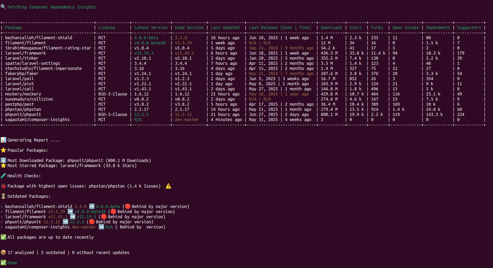

# 📦 Composer Insights

[](https://github.com/sagautam5/composer-insights/stargazers)
[](//packagist.org/packages/sagautam5/composer-insights)
[](//packagist.org/packages/sagautam5/composer-insights)

[](https://github.com/sagautam5/composer-insights/network/members) 
[](https://github.com/sagautam5/composer-insights/actions/workflows/ci.yml)

**Composer Insights** is a CLI tool that analyzes your PHP project's composer dependencies and provides insightful GitHub and Packagist statistics for each top-level dependency.

---

## ✨ Features

- 🔍 Analyze direct dependencies from composer
- ⭐ Fetch GitHub repository data: stars, forks, open issues, last update
- 📈 Get download stats from Packagist
- 🧹 Clean tabular output in the terminal
- 🛑 Gracefully skips non-GitHub packages
- ⚡ Fast, dependency-free CLI experience
- 📊 Clean color-coded analysis summary
---

## 💡Example Output
```bash
vendor\bin\composer-insights analyze
```

---

## 📋 Requirements

- PHP 8.2 or higher
- A Composer-based project
- Internet connection

---

## 📥 Installation

You can install it in any Composer-based local PHP project as dev dependency:

```bash
composer require sagautam5/composer-insights --dev
```

Make sure your project has both `composer.json` and `composer.lock` files.

To avoid GitHub API rate limits and to enable access to public repositories, set your GitHub token as an environment variable:

```bash
export GITHUB_TOKEN=your_github_token
```

You can generate a personal access token from [https://github.com/settings/tokens](https://github.com/settings/tokens)

## 📸 Screenshots

**Classic Token Option**


**Privillages For Token**


---

## 🧪 Usage

Run the following command to start the analysis:

```bash
vendor/bin/composer-insights analyze
```

## 🔧 Command Options for `analyze`

Here are the available options for the `analyze` command:

| Option            | Description                                                               |
| ----------------- | ------------------------------------------------------------------------- |
| `--days=180`      | *(Optional)* Number of days to look back for health check (default: 180). |
| `--dev`           | Include only development dependencies in the analysis.                    |
| `--prod`          | Include only production dependencies in the analysis.                     |
| `--export=FORMAT` | Export results to a file. Accepts `json` or `csv`.                        |
| `--no-summary`    | Do not show summary statistics in the console output.                     |
| `--no-table`      | Do not show the table view in the console output.                         |

By default, all dependencies (both production and development) will be analyzed.

---

### 🛠️ What This Command Does

- Parses your `composer.json` and `composer.lock`
- Analyzes only **direct dependencies** (ignores transitive)
- Fetches GitHub and Packagist stats
- Displays a clean, color-coded CLI table
- Displays a clean, color-coded summary

## 🪪 License

This package is open-sourced under the [MIT License](LICENSE).

---

## 🔐 Security
If you discover a security vulnerability within this package, please send an e-mail to sagautam5@gmail.com, All security vulnerabilities will be promptly addressed.

## 🤝 Contributing

Want to contribute to Composer Insights ? Please read our [Contributing Guide](CONTRIBUTING.md) for details on our code of conduct and the process for submitting pull requests.

We welcome all contributions, whether it's:

- Reporting a bug
- Discussing the current state of the code
- Submitting a fix
- Proposing new features
- Becoming a maintainer


 ---
 ### 🙌 Contributors

- [Sagar Gautam](https://github.com/sagautam5) – Creator & Maintainer
- **ALL Contributors**
---

Enjoy analyzing your dependencies! 🎉

